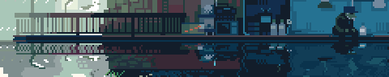

 

  

###

  

###

<h1 align="center">hey there 👋</h1>

###

<h3 align="left">👩‍💻  About Me</h3>

###

I'm Abdessami Guebli from Algeria, Data Science and Artificial Intelligence Student  - 🔭 I’m trynna start working as freelancer this year - 📚 I'm currently learning AI at the  university of Constantine 2  - ⚡ In my free time I play games and CTFs

###

  
  
  

###

<h3 align="left">🛠 Web development tools</h3>

###

  
  
  
  
  
  
  
  
  
  
  
  
  
  
  
  
  

###

<h3 align="left">🛠 Data Science and Artificial Intelligence</h3>

###

  
  
  
  
  
  
  
  
  
  
  
  
  

###

<h3 align="left">🛠 Other tools</h3>

###

  
  
  
  
  
  
  
  
  
  
  
  
  
  
  
  
  
  
  
  
  
  
  

###

<h3 align="left">🔥   My Stats :</h3>

###

  
  
  
  

###

###
